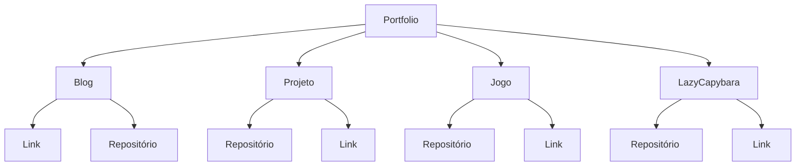

# Rodrigo's Portfolio &nbsp;&#128054;

    

 

    

 

Link Repositório Blog : https://github.com/rodrigo-br/Portfolio/tree/main/Blog%20Extraordinario%20Insolito

Link Blog : http://extraordinarioinsolito.com/

Link Repositório Projeto Pandas Filmes de Terror https://github.com/rodrigo-br/Portfolio/tree/main/Melhores%20filmes%20terror%20iMDB

Link Repositório Calculadora : https://github.com/rodrigo-br/Portfolio/tree/main/Calculadora%20contas%20individuais%20LazyProject

Link Código Calculadora : https://github.com/rodrigo-br/Portfolio/blob/main/Calculadora%20contas%20individuais%20LazyProject/code/lazycapybara.py

Link Repositório Jogo de Luta : https://github.com/rodrigo-br/Portfolio/tree/main/Jogo%20de%20luta%20por%20turnos

Link Código Jogo de Luta : https://github.com/rodrigo-br/Portfolio/blob/main/Jogo%20de%20luta%20por%20turnos/code/avaliacao.py

